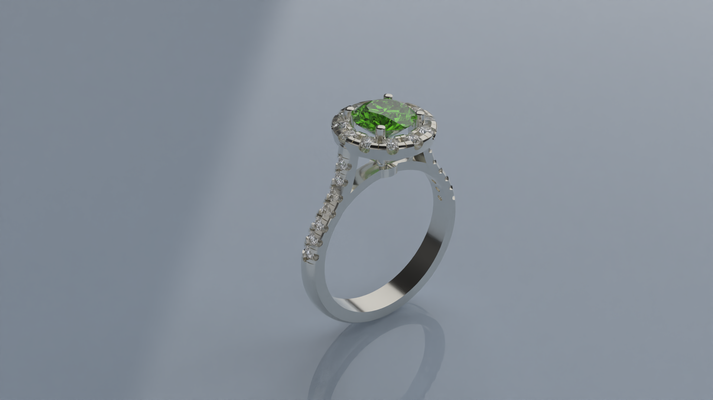

# Apply Materials and Render

### **Step 1: Render Panel**

Go to the "Render and Animation" tab.

### **Step 2: Materials**

For the final render, go to the render and animation tab:

* Select the metals and give them a Gold 14k material.
* Select the main gem and apply the "Peridot Green" material.
* Select the other gems and apply the "Diamond" material.

_Use the "Hide" command to temporarily hide the metals. To do this, with the metals selected, type **hide** in the command bar. To show the hidden elements again, simply type **show** in the command bar."_

### **Step 3: Show command** &#x20;

Use the Show command in the command bar to display the metals again.

### **Step 4: Render Parameters**

The last step will be to set the parameters for the render and we will have our complete model.

### **Step 5:** Render

Press the render button.

<figure><figcaption></figcaption></figure>
